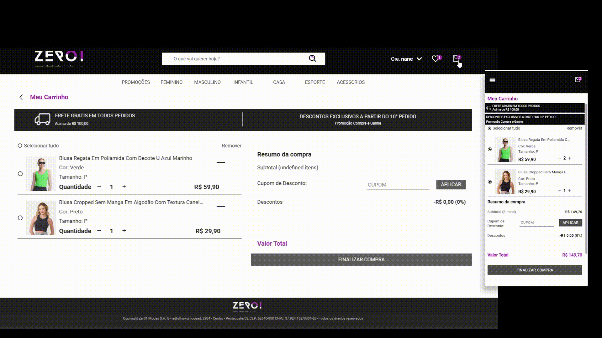

    

Este é um site de vendas responsivo desenvolvido com React Js e Styled Components para uma loja fictícia. A aplicação apresenta um catálogo de roupas onde os usuários podem visualizar as peças, verificar os tamanhos e cores disponíveis, adicionar itens ao carrinho, favoritar peças de roupas e pesquisar o que desejam.

Além disso, o administrador da loja (user adm) tem a capacidade de editar o catálogo, adicionando, editando ou removendo itens da loja. O administrador também pode adicionar promoções e novos cupons de desconto para os usuários.

> Acesso: [Zer01Modas](https://zer01modas.netlify.app)

> Api: [api_zer01modas](https://github.com/rayaneacacio/api-zer01modas)

<h2> ! Video Institucional </h2>

  

<h2> ! Navegação.</h2>

  
primeira página do site:

  

 
 

  
página de catálogo de produtos:

  

 
 

  
página que contém todas as informações de um produto:

  

 
 

  
páginas do carrinho de compras e de pagamento:

  

 
 

  
(páginas de administração) criação e edição de produtos e de cupons de desconto:

  
Experimente o site como administrador, as mudanças não serão permanentes.

  
email: mavis@gmail.com; senha: 1234

  

##

---

  Made with 💜 by <a href="https://www.linkedin.com/in/rayane-ac%C3%A1cio-274092252/"> Rayane Acácio </a>

